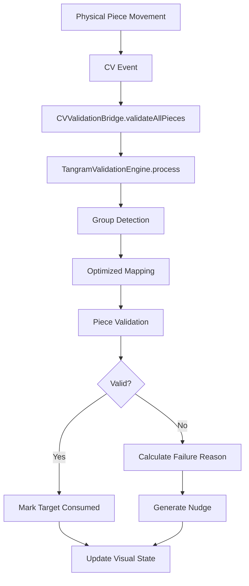

# Tangram Game Architecture: Dual-World Design

## Overview

The Tangram game implements a unique **dual-world architecture** that bridges physical and digital play:

- **Bottom Panel**: Represents the **physical world** where children manipulate real tangram pieces on a table
- **Top Panel**: Represents the **digital iPad display** showing target silhouettes and providing visual feedback
- **Computer Vision Bridge**: CV events flow from physical → digital, creating seamless interaction

This design enables children to learn through tactile manipulation while receiving intelligent digital guidance.

## Architecture Components

### 1. The Two Worlds

#### Physical World (Bottom Panel)
- **Location**: `physicalWorldSection` in `TangramPuzzleScene`
- **Purpose**: Interactive area where puzzle pieces can be moved, rotated, and flipped
- **Behavior**: 
  - Touch gestures manipulate pieces
  - Physics simulation provides realistic movement
  - Pieces emit CV events on movement
  - No validation visuals shown here (pure physical realism)

#### Digital World (Top Panel)
- **Location**: `targetSection` in `TangramPuzzleScene`
- **Components**:
  - Target silhouettes showing the puzzle to solve
  - Mini CV display (top-right corner) mirroring physical pieces
  - Smart nudges appearing in target areas
  - Hint animations overlaying targets
- **Behavior**:
  - Consumes CV events from physical world
  - Shows validation feedback (green/red outlines)
  - Displays guidance without disrupting physical play

### 2. Computer Vision Event Flow

```
Physical Piece Movement → CV Event Emission → Event Bus → Digital Consumption
```

#### Event Pipeline
1. **Piece Moved** (`TangramPuzzleScene.touchesMoved`)
   - Updates piece position/rotation in physical world
   - Calls `emitCVFrameUpdate()` to broadcast state

2. **CV Frame Creation** (`TangramSceneCVBridge.emitCVFrameUpdate`)
   - Collects all moved/placed pieces
   - Creates `CVFrameEvent` with piece observations
   - Emits via `eventBus.emitFrame()`

3. **Digital Processing** (`TangramSceneCVBridge.updateCVRender`)
   - Receives frame events via subscription
   - Updates mini CV display
   - Triggers validation after 100ms throttle
   - Shows visual feedback in target area only

## Validation System

### Unified Validation Engine

The entire validation system flows through a single engine that implements the optimization approach from `.mitch-docs/optimization-validation.md`:

#### Core Components

1. **TangramValidationEngine** (`Services/TangramValidationEngine.swift`)
   - Single source of truth for all validation
   - Orchestrates mapping, validation, hints, and nudges
   - Manages piece-to-target bindings
   - Tracks validation state across the puzzle

2. **CVValidationBridge** (`Views/Components/CVValidationBridge.swift`)
   - Adapter between scene (View) and engine (Service)
   - Converts scene state to engine format
   - Applies validation results back to scene
   - Manages validation throttling (200ms for movement, 500ms for placement)

3. **OptimizationValidator** (`Services/OptimizationValidator.swift`)
   - Implements global optimization from the plan
   - Finds minimal movement to valid placement
   - Provides confidence scores for validation
   - Unified tolerance configuration from game constants

### Validation Flow



### Key Innovations

1. **Optimized Group Mapping**
   - Uses global optimization to find best rotation/translation for entire group
   - Caches mappings to prevent jitter
   - Computes flip parity for parallelogram handling

2. **Instance-Based Target Binding**
   - Each piece instance binds to specific target instance
   - Prevents piece swapping issues with duplicate types
   - Maintains stable piece-target relationships

3. **Throttled Validation**
   - 200ms throttle for moving pieces (performance)
   - 500ms delay for placement validation (stability)
   - Only validates pieces with significant velocity changes

## Hints and Nudges System

### Smart Nudges (Gentle Guidance)

**Purpose**: Provide subtle, non-intrusive guidance when pieces are close but not quite right

**Implementation**:
- Generated by `SmartNudgeManager` based on validation failures
- Displayed ONLY in top panel target area
- Never shown in physical world (maintains realism)
- Silenced during hint animations to avoid overlap

**Nudge Levels** (progressive assistance):
1. `visual` - Pulse or glow
2. `gentle` - "Almost there!"
3. `specific` - "Try rotating"
4. `directed` - Arrow indicators
5. `solution` - Show exact placement

### Structured Hints (Explicit Help)

**Purpose**: Step-by-step guidance when explicitly requested or player is stuck

**Implementation**:
- `TangramHintEngine` determines appropriate hint based on:
  - Last moved piece correctness
  - Time since progress (30s threshold)
  - Validated neighbors (adjacency-aware)
  - Piece difficulty ranking
- Returns `HintData` with animation steps
- Scene displays hint overlay in target area

**Hint Selection Algorithm**:
1. Check if last moved piece was incorrect → show correction
2. If stuck > 30s → suggest easiest unplaced piece
3. If hint requested → find piece adjacent to validated group
4. Use difficulty weights: small triangles (easy) → parallelogram (hard)

## File Structure and Responsibilities

### Core Scene Files

- **`TangramPuzzleScene.swift`**
  - Main scene managing both worlds
  - Touch handling for physical manipulation
  - Delegates validation to CVValidationBridge

- **`TangramSceneCVBridge.swift`** (Extension)
  - Event subscription and CV frame emission
  - Mini CV display rendering
  - Triggers validation on frame updates

- **`TangramSceneValidator.swift`** (Extension)
  - Thin delegation layer
  - Routes validation calls to CVValidationBridge
  - Handles puzzle completion

### Validation Services

- **`TangramValidationEngine.swift`**
  - Main validation orchestrator
  - Integrates all subsystems
  - Manages validation state

- **`OptimizationValidator.swift`**
  - Global optimization algorithm
  - Minimal movement calculations
  - Unified tolerance management

- **`TangramRelativeMappingService.swift`**
  - Group-to-target space mapping
  - Optimized mapping with caching
  - Flip parity computation

- **`TangramPieceValidator.swift`**
  - Canonical validation logic
  - Feature angle validation
  - Parallelogram flip detection

### Support Systems

- **`SmartNudgeManager.swift`**
  - Progressive nudge generation
  - Difficulty-aware content

- **`TangramHintEngine.swift`**
  - Intelligent hint selection
  - Adjacency-aware suggestions
  - Animation step generation

- **`ConstructionGroupManager.swift`**
  - Detects connected piece groups
  - Edge contact validation
  - Group relationship tracking

### Bridge Components

- **`CVValidationBridge.swift`**
  - Scene ↔ Engine adapter
  - State conversion
  - Result application
  - Throttling logic

- **`PuzzlePieceNode.swift`**
  - Piece representation
  - State visualization
  - Touch handling

## Configuration and Tolerances

### Unified Tolerance System

All tolerances flow from `TangramGameConstants.Validation.tolerances(for: difficulty)`:

```swift
// Easy
position: 25, rotation: 20°, edgeContact: 18

// Normal  
position: 18, rotation: 15°, edgeContact: 14

// Hard
position: 12, rotation: 10°, edgeContact: 10
```

### Difficulty Propagation

1. Scene sets difficulty on `CVValidationBridge` initialization
2. Bridge passes to `TangramValidationEngine`
3. Engine configures all subsystems:
   - `TangramPieceValidator` tolerances
   - `OptimizationValidator` config
   - `TangramHintEngine` thresholds
   - `SmartNudgeManager` progression

## Event Bus Communication

### Event Types

```swift
enum TangramCVEvent {
    case pieceDetected(id: String)
    case pieceMoved(id: String, position: CGPoint)
    case piecePlaced(id: String)
    case pieceFlipped(id: String, isFlipped: Bool)
    case validationChanged(pieceId: String, isValid: Bool)
    case pieceLifted(id: String)
    case pieceMissing(id: String)
}
```

### Frame Events

```swift
struct CVFrameEvent {
    let objects: [CVPieceEvent]  // All visible pieces
}
```

### Event Flow Example

1. Child moves physical piece
2. Scene emits `pieceMoved` event
3. Scene emits `CVFrameEvent` with all pieces
4. Digital world updates mini CV display
5. Validation triggers after throttle
6. `validationChanged` event updates target visuals
7. Nudge appears in target area if needed

## Implementation of optimization-validation.md

### Achieved Goals

✅ **Unified Validation Engine**
- Single `TangramValidationEngine` orchestrates everything
- No duplicate validation paths
- Consistent tolerance application

✅ **Optimized Mapping**
- Global optimization in `establishOrUpdateMappingOptimized`
- Grid search for optimal rotation
- Cached mappings prevent recomputation

✅ **Top-Only Guidance**
- Nudges display only in target section
- Physical world remains purely tactile
- Clear separation of concerns

✅ **CV Integration**
- Frame-based validation with throttling
- Event-driven architecture
- Smooth digital mirror of physical state

✅ **Smart Progression**
- Nudges increase in specificity
- Hints consider adjacency
- Difficulty-aware assistance

### Technical Achievements

1. **Zero Legacy Code**: Removed `validatePiecesLegacy()` completely
2. **Unified Tolerances**: All components use `TangramGameConstants`
3. **Stable Bindings**: Instance-based piece-target relationships
4. **Performance**: Throttled validation, cached mappings
5. **Parallelogram Handling**: Flip parity computed correctly

## Testing the System

### Manual Testing Flow

1. **Place First Piece**
   - Move piece in physical world
   - Observe mini CV mirror update
   - See validation after 500ms
   - Target fills with color if valid

2. **Test Group Validation**
   - Place 2+ connected pieces
   - Observe mapping establishment
   - Move group together
   - Validation maintains consistency

3. **Request Hint**
   - Tap hint button
   - Observe adjacency-based selection
   - See animation in target area
   - Physical pieces unaffected

4. **Trigger Nudges**
   - Place piece almost correctly
   - Wait for validation
   - See nudge in target only
   - Progressive assistance on retries

### Debug Output

Enable console logging to observe:
- `[MAPPING-OPT]` - Optimized mapping establishment
- `[VALIDATION]` - Piece validation results  
- `[NUDGE]` - Nudge generation
- `[HINT]` - Hint selection logic
- `[CV-FRAME]` - Frame processing

## Future Enhancements

1. **Adaptive Difficulty**
   - Auto-adjust based on struggle patterns
   - Track per-piece difficulty scores

2. **Multi-Modal Feedback**
   - Audio cues for validation
   - Haptic feedback on iPad

3. **Learning Analytics**
   - Track common error patterns
   - Identify learning progressions

4. **Advanced CV**
   - 3D pose estimation
   - Occlusion handling
   - Multi-hand tracking

## Conclusion

The dual-world architecture successfully bridges physical and digital play, providing intelligent assistance without disrupting tactile learning. The unified validation engine ensures consistency while the optimization approach enables robust, efficient validation. The clear separation between physical manipulation and digital guidance preserves the benefits of both worlds.