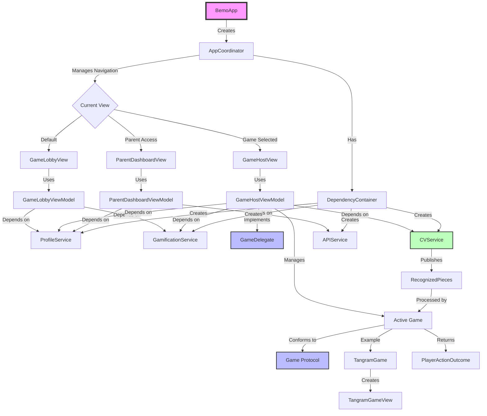

# Bemo - Educational Game Platform for Children

Bemo is an iOS educational game platform that uses computer vision to create interactive learning experiences for children. Built with SwiftUI and following MVVM-S architecture, it features a plug-and-play game engine system that makes it easy to add new educational games.

## 🎮 Features

- **Computer Vision Integration**: Uses device camera to recognize physical game pieces
- **Modular Game System**: Plug-and-play architecture for easy game addition
- **Child Profiles**: Support for multiple children with individual progress tracking
- **Gamification**: XP system, achievements, and level progression
- **Parent Dashboard**: Monitor progress and manage settings
- **Frustration Detection**: CV-based emotion recognition to adapt difficulty

## 🏗️ Architecture Overview

The app follows MVVM-S (Model-View-ViewModel-Service) architecture with a focus on modularity and testability.



### Core Components

#### 1. App Core
- **BemoApp**: SwiftUI app entry point with `@main`
- **AppCoordinator**: Central navigation controller managing view transitions
- **DependencyContainer**: Service locator providing all app services

#### 2. Game Engine
- **Game Protocol**: Contract for all games defining required functionality
- **GameDelegate**: Communication channel from games back to the host
- **GameHostView/ViewModel**: Container that manages active game sessions

#### 3. Services Layer
- **CVService**: Computer vision wrapper publishing recognized game pieces via Combine
- **ProfileService**: Manages active child profile and session
- **GamificationService**: Handles XP, achievements, and progression
- **APIService**: Backend communication for data persistence

#### 4. Features
- **Game Lobby**: Game selection interface with child profiles
- **Games**: Individual game implementations (e.g., Tangram)
- **Parent Dashboard**: Analytics and settings management

### Data Flow Example

When a child places a physical game piece:

1. **CVService** captures and processes camera frame
2. Publishes `[RecognizedPiece]` via Combine
3. **GameHostViewModel** receives pieces and forwards to active game
4. **Game** processes pieces and returns `PlayerActionOutcome`
5. **GameHostViewModel** updates UI and awards XP if needed
6. **GamificationService** tracks progress and achievements

## 📁 Project Structure


## 🚀 Getting Started

### Prerequisites
- Xcode 15.0+
- iOS 17.0+
- Swift 5.9+

## 🎯 Adding a New Game

1. Create a new folder under `Features/Game/Games/YourGame/`
2. Implement the `Game` protocol:

```swift
class YourGame: Game {
    let id = "your_game"
    let title = "Your Game Title"
    
    func makeGameView(delegate: GameDelegate) -> AnyView {
        // Return your game's SwiftUI view
    }
    
    func processRecognizedPieces(_ pieces: [RecognizedPiece]) -> PlayerActionOutcome {
        // Process CV input and return outcome
    }
}
```

3. Add your game to the `GameLobbyViewModel` available games list

## 💻 Development Guidelines

- Follow MVVM-S architecture pattern
- Use SwiftUI for reactive programming
- Prefer protocols and value types (structs)
- Inject dependencies through initializers
- Write unit tests for ViewModels and Services
- Use `@Observable` for observable state
- Use `@State` for owned ViewModels
- Use `@Bindable` for two-way bindings
- Handle all screen sizes and orientations

## 📄 License

This project is proprietary software. All rights reserved.

## 🤝 Contributing

Please read our contributing guidelines before submitting pull requests.

## 📧 Contact

For questions or support, please contact the development team.